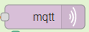
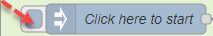
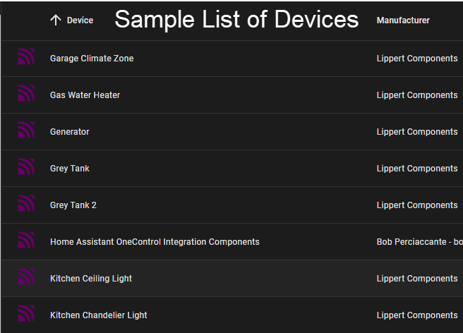

### ***I have traded in my Momentum, and my new Solitude does not have the same integration, so I am unable to continue development until such time as I have access to another environment.***
Lippert OneControl and Home Assistant Integration 
=================================================

### About 

This is a project that is designed to utilize Node Red to connect to your Lippert OneControl cloud bridge and download the entities into your Home Assistant instance, allowing you to control most items in your RV.

This has been tested on the following:
- 2021 Grand Design Momentum 397TH-R
- 2022 Grand Design Momentum 397THS
- Additional samples are always appreciated

(Very basic dashboard example - see "[sample_dash.yaml](sample_dashboard.yaml)")

### Requirements
- **MUST** have a local network that contains the OneControl Cloud Bridge / Connect Anywhere (even if you are not subscribed to the cloud service)
- Home Assistant installed and attached to the same local network inside your RV.
- MQTT Discovery must be enabled on your Home Assistant instance: [https://www.home-assistant.io/integrations/mqtt/#mqtt-discovery/](https://www.home-assistant.io/integrations/mqtt/#mqtt-discovery)
- MQTT broker (Flows are pre configured to use the Mosquitto add-on in Home Assistant)
- Node Red installed as a service / Add-on on same device as your Home Assistant instance (recommend the official Home Assistant add-on)
- "node-red-contrib-sse-client" node must be installed in Node Red from the hamburger menu -> Manage Pallette -> Install.  Details can be found here - https://flows.nodered.org/node/node-red-contrib-sse-client

### How it Works

#### Downloading, installing and initial setup
1. Download the "[flows.json file](flow.json)" file.  In your Node Red instance, from the hamburger menu, select "Import" and then "Select a file to import".  Select the "flows.json" file you downloaded, and import.
2. Once installed, make sure that the credentials for your MQTT server are correct in the MQTT Out nodes.  Select the node, in OneControl Discovery tab -> double click on the node -> click the pencil next to server -> Security Tab -> Enter the HA username and password you want to use for mqtt.
3. Deploy the flow
4. Click on  under "Collect Devices from OneControl"
5. Click on  under "Create Control Entities"

#### About the Discovery process
Please note that there are three tabs in this config:
- **OneControl Discovery**
  - This is used to connect to your OneControl system and create the necessary Home Assistant entities
  - This creates the needed entities and inserts them into Home Assistant via MQTT discovery
- **OneControl Monitor**
  - This flow connects to the OneControl event stream to download state information via SSE-Client
  - State information is transformed as necessary and published to the appropriate MQTT topics
  - MQTT is also monitored for commands from Home Assistant that are then sent to OneControl via HTTP
- **Tools**
  - This flow contains useful tools to help in troubleshooting and enhancements.
---
Inside the Discovery flow, there is a node named "Process Configuration" and it contains a number of tools available to you.  

Please familiarize yourself with the options before running the tool:
- Save the configurations generated as YAML and JSON, with or without the MQTT Discovery specific content
- Opt to NOT send to MQTT, to use the tool simply to generate the config files.  NOTE: You will still need the Monitor flows to handle the messages
- Opt to set MQTT messages to be retained or not, allowing the configs to persist after reboots
- Generate initial availability messages to bypass the wait for OneControl to send the initial message (which can take up to 30 mins)
- Delete all configs from MQTT in HomeAssistant (good for testing and upgrades)
- Enable/disable automatic connection to OneControl event feed
- Enable/disable automatic sending updates to OneControl
---
After the initial run, you will be able to control most features from within the Home Assistant interface.  The entities created to manage the integration are located in the Mosquitto Broker integration.  To access these tools, from your Home Assistant console, navigate to "Settings" -> "Devices and Services" then under the "Mosquitto Broker" integration, you will see a link to your devices.  Follow this link to the list of your MQTT devices.

You can also click on "Home Assistant OneControl Integration Components" here for some troubleshooting tools.

### Limitations:
- Physical devices such as slides and awnings are NOT currently supported due to the complexity of the integration and the risks associated with the potential for damage.
- RGB Lights (Accent Lights) are not yet supported due to differences in how data is handled between the two platforms.  This is under development.

### Update log:
2022-01-22:
- Updated to version 2022-01-21b
  - Visual cleanup across all nodes
  - Improving comments in code (more work to come)
  - Creation of Home Assistant entities that can be used to manage the integration from the HA environment, including automation's, etc.  Found under the MQTT integration entities list
  - Initial values for entities at time of creation are pulled from OneControl and populated to speed state updates
  - Initial values for availability topics pre-populated to speed installation
  - Initial stages of diagnostic feedback in place

OneControl is a registered trademark of Lippert Components, Inc.
